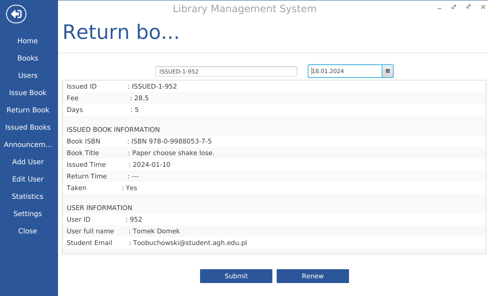
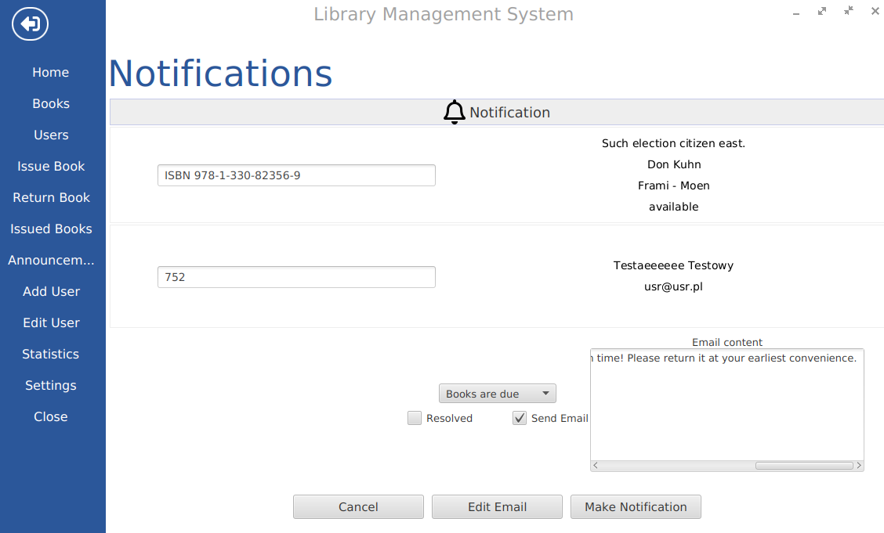
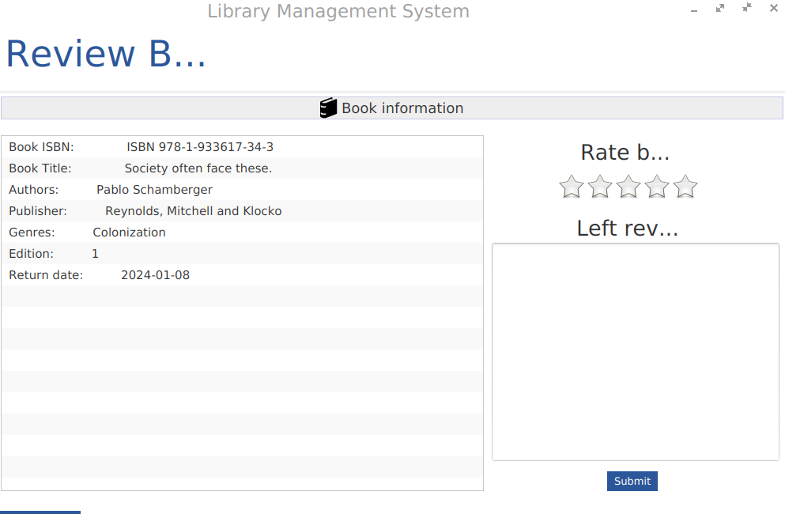

# Documentation

## Table of Contents

- [Documentation](#documentation)
  - [Technologies](#technologies)
  - [Setup](#setup)
  - [Database Schema](#database-schema)
  - [Object Schema](#object-schema)
  - [Adding a New User](#adding-a-new-user)
  - [Data Display](#data-display)
  - [Data Updates And Additions](#data-updates-and-additions)
  - [Profile](#profile)
  - [Settings](#settings)
  - [Announcements](#announcements)
  - [Statistics](#statistics)
  - [Recommendations](#recommendations)
  - [Reviews](#reviews)
  

## Technologies

- Java 17
- Spring Boot
- Spring Data JPA/JDBC
- Spring Mail
- MySQL/MariaDB
- JavaFX
- MaterialFX
- JavaFX-Ikonli
- Ikonli-Fontawesome5
- Lombok
- Gradle

## Setup

Set the database credentials in the `application.properties` file.
```properties
spring.datasource.url=jdbc:mysql://localhost:3306/your_database_name  
spring.datasource.username=your_username  
spring.datasource.password=your_password  
```

Disable `spring.profiles.active=dev`.

Run the file `src/main/java/pl/edu/agh/managementlibrarysystem/ManagementLibrarySystemApplication.java` or execute the command `gradle bootRun` in the root directory of the project.

## Database Schema


## Object Schema


Objects can be found in the directory/package `src/main/java/pl/edu/agh/managementlibrarysystem/models`.

## Adding a New User

### Creating a new user account


### Adding and Modifying Users as an Admin


## Data Display

### Viewing Books


### Viewing Additional Book Details


### Viewing Borrowed Books


### Viewing Notifications


### Viewing Users


## Data Updates And Additions

### Adding Books to the Library (including authors, publishers, and genres)


### Returning or Renewing a Book (if days are specified)


### Borrowing a Book


## Profile

### Viewing and Modifying User Profiles


## Settings

### Changing System Settings as an Administrator
- Changing the admin password:
  
- Modifying fees:
  
- Configuring the SMTP server:
  

## Announcements

### Sending Notification Emails to Users (by librarian or administrator)


## Statistics

### Available for both regular users and administrators/librarians:
- **User Statistics**:
  
- **Admin Statistics**:
  
- **Shared Visualizations**:
  

## Recommendations

A module providing book recommendations to users based on observed preferences:


## Reviews

Allows users to review and rate books:

