# Dokumentacja

## Spis treści

- [Dokumentacja](#dokumentacja)
  - [Spis treści](#spis-treści)
  - [Technologie](#technologie)
  - [Uruchomienie](#uruchomienie)
  - [Schemat bazydanych](#schemat-bazydanych)
  - [Schemat obiektowy](#schemat-obiektowy)
  - [GUI](#gui)
  - [Dodawanie nowego użytkownika](#dodawanie-nowego-użytkownika)

## Technologie

- Java 17
- Spring Boot
- Spring Data JPA/JDBC
- Spring mail
- MySQL/MariaDB
- JavaFX
- MaterialFX
- JavaFX-Ikonli
- Ikonli-Fontawesome5
- Lombok
- Gradle

## Uruchomienie

Należy w pliku `application.properties` ustawić dane do bazy danych.

```properties
spring.datasource.url=jdbc:mysql://localhost:3306/your_database_name
spring.datasource.username=your_username
spring.datasource.password=your_password
```

i wyłączyć  `spring.profiles.active=dev`

Wystarczy uruchomić plik `src/main/java/pl/edu/agh/managementlibrarysystem/ManagementLibrarySystemApplication.java`
albo uruchomić komendę `gradle bootRun` w katalogu głównym projektu.

## Schemat bazydanych

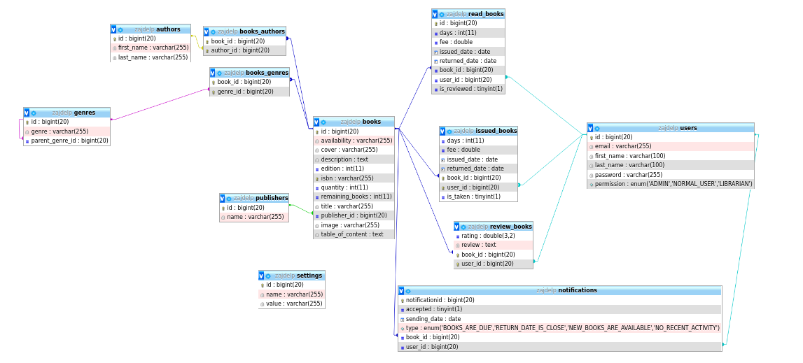

## Schemat obiektowy

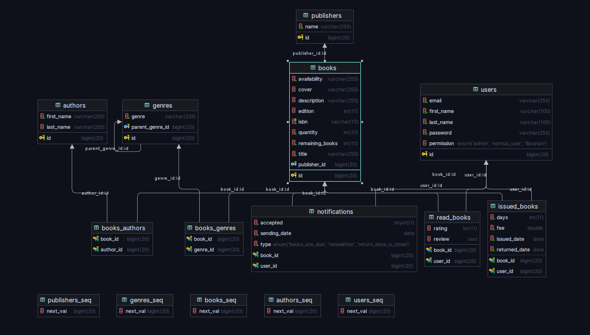

Obiekty znajdują się w katalogu/pakiecie `src/main/java/pl/edu/agh/managementlibrarysystem/models`.

## Dodawanie nowego użytkownika

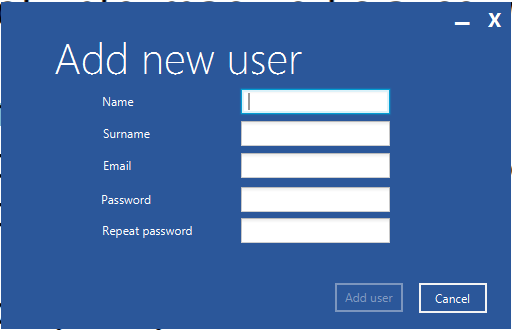

## Dodawanie i modyfikacja użytkownika od strony administratora:
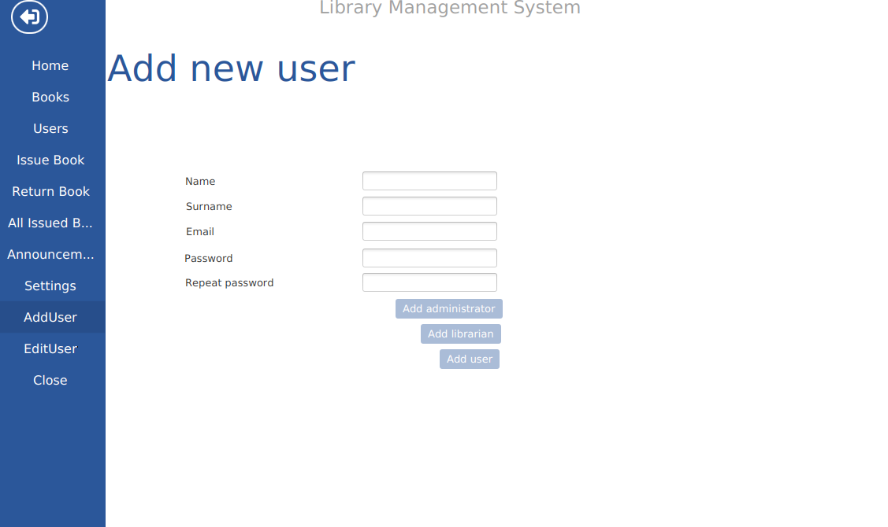
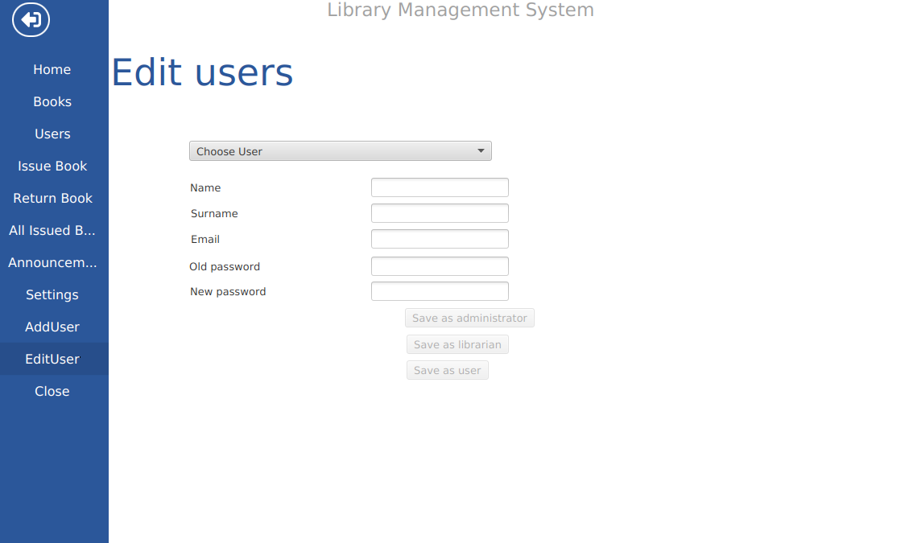

## Wyświetlanie danych

### Wyświetlanie książek:


### Wyświetlanie dodatkowych informacji o książce:

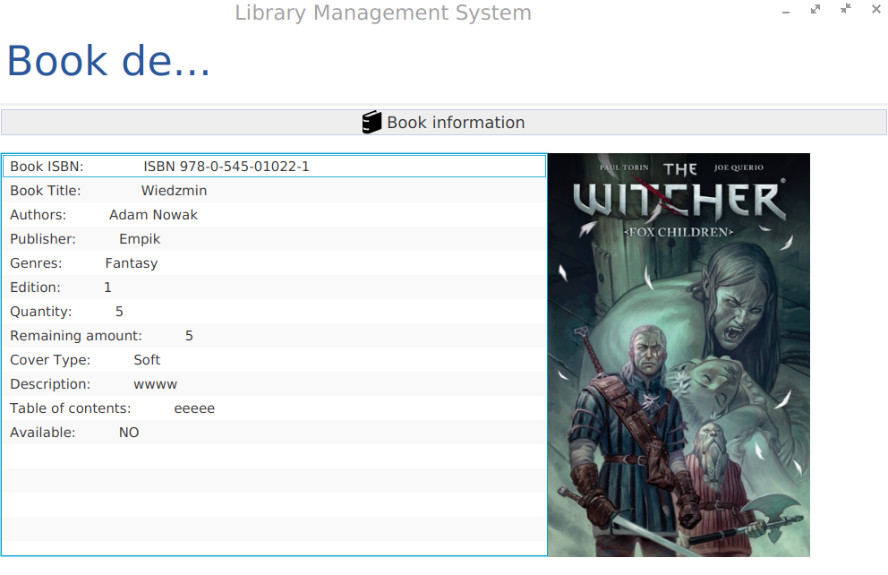

### Wyświetlanie wypożyczonych książek:


### Wyświetlanie powiadomień:

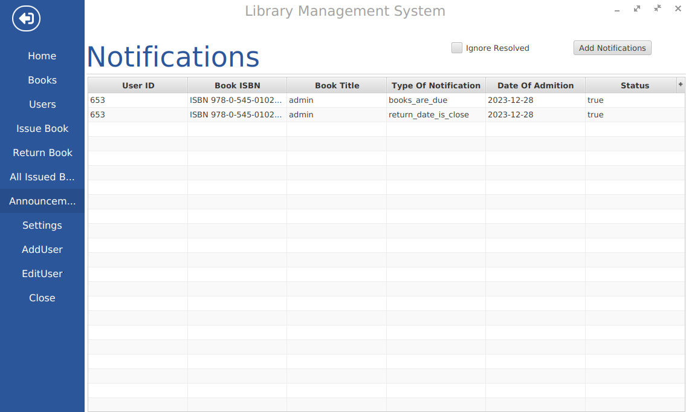

### Wyświetlanie użytkowników:


## Aktualizacja/dodawanie danych

### Podczas dodawania książek do biblioteki możliwe jest również dodanie nowych autorów, wydawców, oraz gatunków:
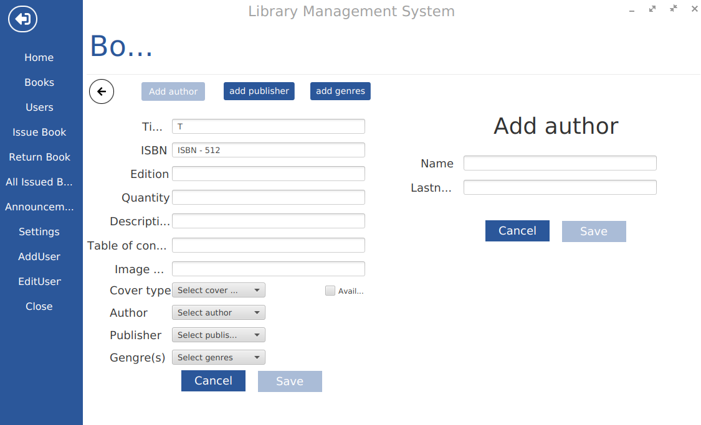

### Zwrot/odnowienie książki (jeśli podana została liczba dni):


### Wypożyczenie książki:


## Profil

### Klient biblioteki może wyświetlać i modyfikować swój profil:


## Settings

### Administrator może zmienić globalne ustawienia systemu zarządzającego np. wartość opłat, serwer SMTP z którego korzystać będzie system:
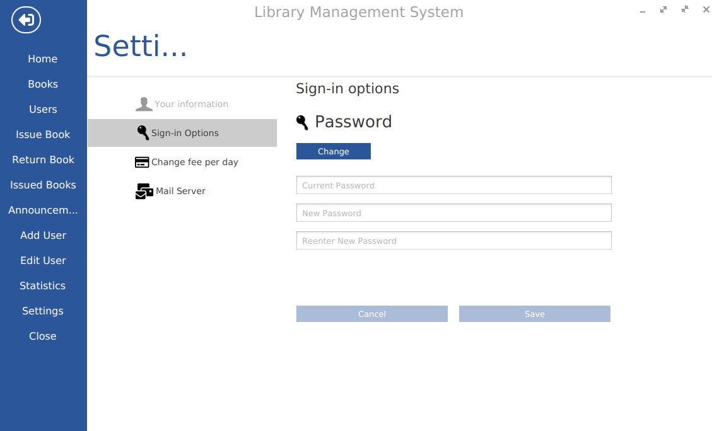
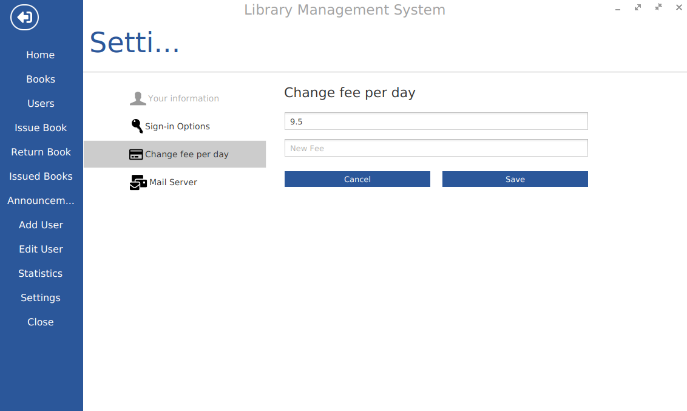


## Annoucements

### Bibliotekarz oraz administrator mogą zlecać wysyłanie maili powiadamiających odpowiednich użytkowników:


## Statistics

### Statystyki dostępne zarówno dla zwykłych użytkowników jak i dla administratorów/bibliotekarzy

- Dla użytkowników:


- Dla użytkowników:
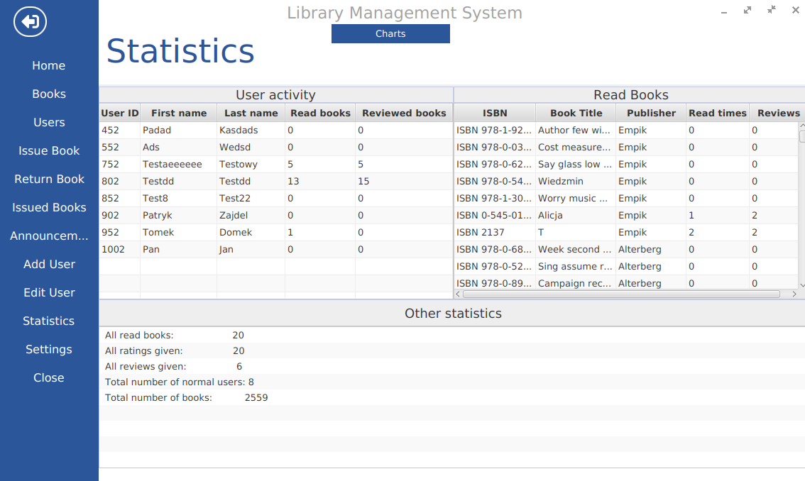

- Wspólne:


## Recomendations

Część aplikacji odpowiadająca za polecanie użytkownikom książek na podstawie zaobserwowanych preferencji:


## Reviews

Pozwala użytkownikom na ocenę oraz recenzję książek:


