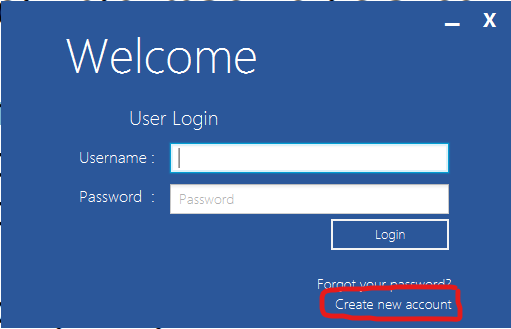
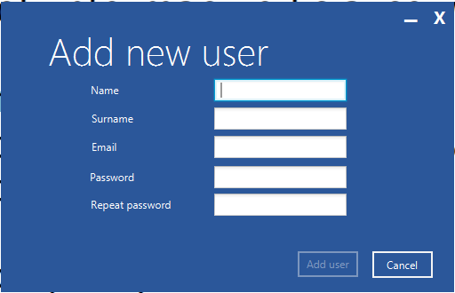

# Dokumentacja

## Spis treści

- [Dokumentacja](#dokumentacja)
  - [Spis treści](#spis-treści)
  - [Technologie](#technologie)
  - [Uruchomienie](#uruchomienie)
  - [Schemat bazydanych](#schemat-bazydanych)
  - [Schemat obiektowy](#schemat-obiektowy)
  - [Dodawanie nowego użytkownika](#dodawanie-nowego-użytkownika)

## Technologie

- Java 17
- Spring Boot
- Spring Data JPA/JDBC
- Spring mail
- MySQL/MariaDB
- JavaFX
- MaterialFX
- JavaFX-Ikonli
- Ikonli-Fontawesome5
- Lombok
- Gradle

## Uruchomienie

Należy w pliku `application.properties` ustawić dane do bazy danych.

```properties
spring.datasource.url=jdbc:mysql://localhost:3306/your_database_name
spring.datasource.username=your_username
spring.datasource.password=your_password
```

i wyłączyć  `spring.profiles.active=dev`

Wystarczy uruchomić plik `src/main/java/pl/edu/agh/managementlibrarysystem/ManagementLibrarySystemApplication.java`
albo uruchomić komendę `gradle bootRun` w katalogu głównym projektu.

## Schemat bazydanych


## Schemat obiektowy


Obiekty znajdują się w katalogu/pakiecie `src/main/java/pl/edu/agh/managementlibrarysystem/models`.

## Dodawanie nowego użytkownika

Obiekty związane z dodawaniem użytkownika:

- controllers/AddUserController.java
- services/UserService.java
- repositories/UserRepository.java
- resources/fxml/create-user.fxml



