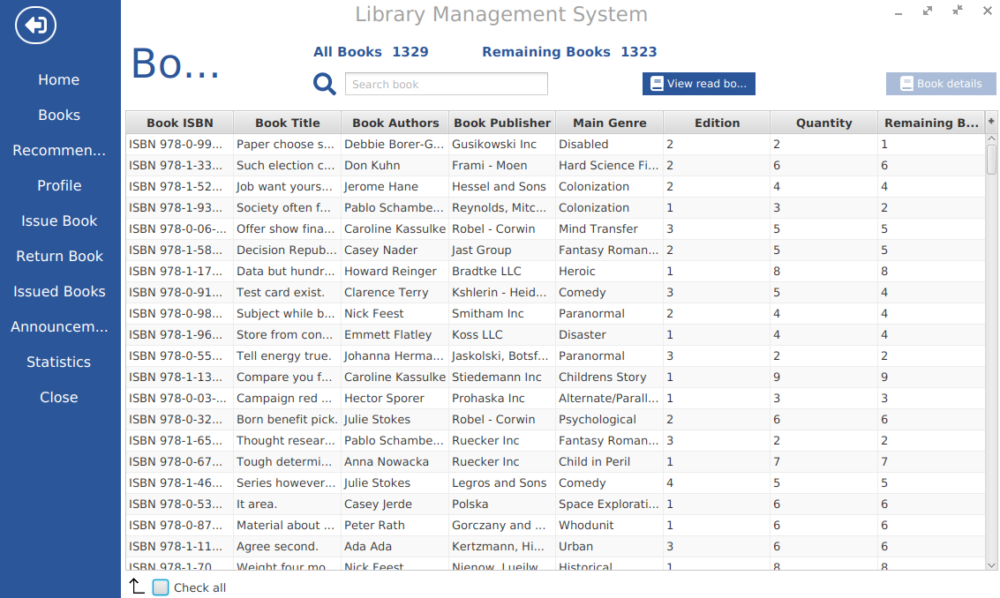
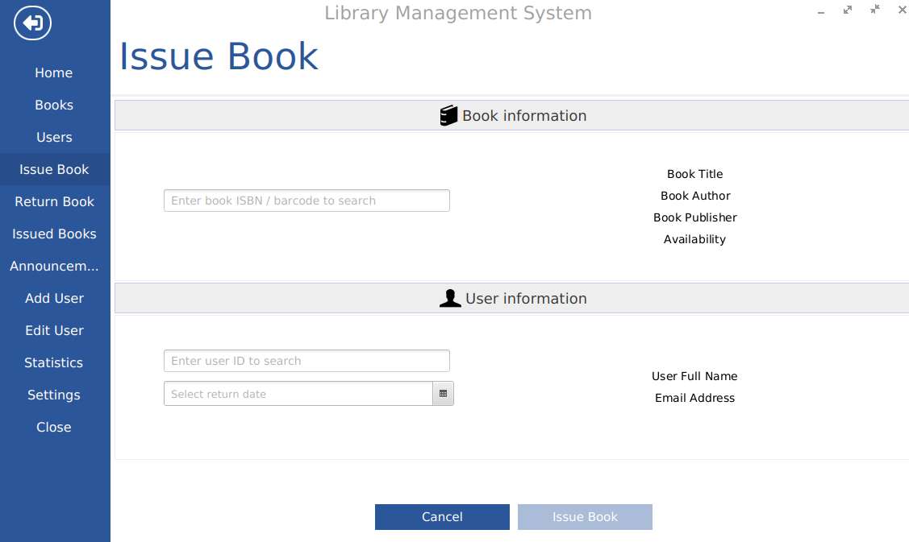
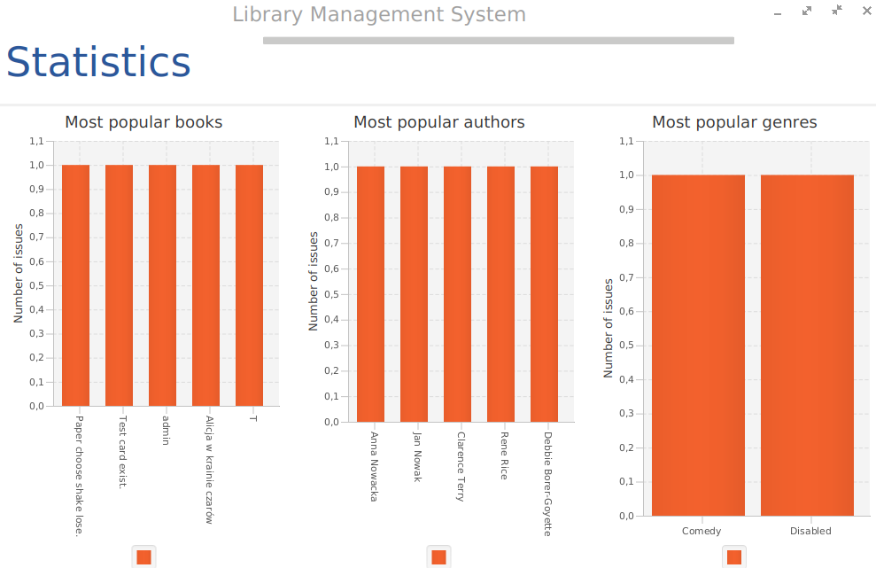

# Dokumentacja

## Spis treści

- [Dokumentacja](#dokumentacja)
  - [Spis treści](#spis-treści)
  - [Technologie](#technologie)
  - [Uruchomienie](#uruchomienie)
  - [Schemat bazydanych](#schemat-bazydanych)
  - [Schemat obiektowy](#schemat-obiektowy)
  - [GUI](#gui)
  - [Dodawanie nowego użytkownika](#dodawanie-nowego-użytkownika)

## Technologie

- Java 17
- Spring Boot
- Spring Data JPA/JDBC
- Spring mail
- MySQL/MariaDB
- JavaFX
- MaterialFX
- JavaFX-Ikonli
- Ikonli-Fontawesome5
- Lombok
- Gradle

## Uruchomienie

Należy w pliku `application.properties` ustawić dane do bazy danych.

```properties
spring.datasource.url=jdbc:mysql://localhost:3306/your_database_name
spring.datasource.username=your_username
spring.datasource.password=your_password
```

i wyłączyć  `spring.profiles.active=dev`

Wystarczy uruchomić plik `src/main/java/pl/edu/agh/managementlibrarysystem/ManagementLibrarySystemApplication.java`
albo uruchomić komendę `gradle bootRun` w katalogu głównym projektu.

## Schemat bazydanych


## Schemat obiektowy


Obiekty znajdują się w katalogu/pakiecie `src/main/java/pl/edu/agh/managementlibrarysystem/models`.

## Dodawanie nowego użytkownika

Obiekty związane z dodawaniem użytkownika:

- controllers/AddUserController.java
- services/UserService.java
- repositories/UserRepository.java
- resources/fxml/create-user.fxml


Dodawanie i modyfikacja użytkownika od strony administratora:

- controllers/AddOtherUserController.java
- controllers/EditUserController.java
- services/UserService.java
- repositories/UserRepository.java
- resources/fxml/editUsers.fxml
- resources/fxml/addOtherUsers.fxml


## Wyświetlanie danych

Wyświetlanie książek:
- controllers/BookController.java
- services/BookService.java
- repositories/BookRepository.java
- resources/fxml/books.fxml



Wyświetlanie dodatkowych informacji o książce:


Wyświetlanie wypożyczonych książek:
- controllers/IssuedBookController.java
- services/BookService.java
- repositories/BookRepository.java
- resources/fxml/issuedBooks.fxml


Wyświetlanie powiadomień:
- controllers/NotificationsController.java
- services/NotificationService.java
- repositories/NotificationRepository.java
- resources/fxml/notifications.fxml


Wyświetlanie użytkowników:
- controllers/AllUserListController.java
- services/UserService.java
- repositories/UserRepository.java
- resources/fxml/usersAdmin.fxml


## Aktualizacja/dodawanie danych

Podczas dodawania książek do biblioteki możliwe jest również dodanie nowych autorów, wydawców, oraz gatunków:
- controllers/entry/AuthorDataEntryController.java
- controllers/entry/BookDataEntryController.java
- controllers/entry/GenresDataEntryController.java
- controllers/entry/PublisherDataEntryController.java
- services/AuthorService.java
- services/BookService.java
- services/GenresService.java
- services/PublisherService.java
- repositories/AuthorRepository.java
- repositories/BookRepository.java
- repositories/GenresRepository.java
- repositories/PublisherRepository.java
- resources/fxml/authorDataEntry.fxml
- resources/fxml/bookDataEntry.fxml
- resources/fxml/genresDataEntry.fxml
- resources/fxml/publisherDataEntry.fxml


Zwrot/odnowienie książki (jeśli podana została liczba dni):
- controllers/ReturnBookController.java
- services/BookService.java
- repositories/BookRepository.java
- resources/returnBook.fxml


Wypożyczenie książki:
- controllers/IssueBookController.java
- services/BookService.java
- services/UserService.java
- repositories/BookRepository.java
- repositories/UserRepository.java
- resources/issueBook.fxml



## Profil

Klient biblioteki może wyświetlać i modyfikować swój profil:
- controllers/ProfileController.java
- services/ProfileService.java
- services/NotificationService.java
- services/BookService.java
- repositories/ProfileRepository.java
- repositories/NotificationRepository.java
- repositories/BookRepository.java
- resources/user.fxml


## Settings

Administrator może zmienić globalne ustawienia systemu zarządzającego np. wartość opłat, serwer SMTP z którego korzystać będzie sysyem:
- resources/adminSettings.fxml
- resources/changeAdminPassword.fxml
- resources/configureEmailServer.fxml
- resources/changeFeePerDay.fxml
- service/UserService.java
- service/SettingsService.java
- session/UserSession.java
- repository/SettingsRepository.java
- repository/UserRepository.java
- controller/AdminSettingsController.java


## Annoucements

Bibliotekarz oraz administrator mogą zlecać wysyłanie maili powiadamiających odpowiednich użytkowników:
- resources/addNotification.fxml
- controller/AddNotificationController.java
- service/EmailService.java
- service/NotificationService.java
- service/BookService.java
- service/UserService.java
- repository/SettingsRepository.java
- repository/BookRepository.java
- repository/UserRepository.java
- repository/IssuedBooksRepository.java


## Statistics

Statystyki dostępne zarówno dla zwykłych użytkowników jak i dla administratorów/bibliotekarzy

Dla użytkowników:
- resources/statisticsUser.fxml
- controller/StatisticsUserController.java


Dla użytkowników:
- resources/statisticsAdmin.fxml
- controller/StatisticsAdminController.java


Wspólne:
- resources/charts.fxml
- controller/popups/ChartsController.java
- service/StatisticsService.java
- repository/UserRepository.java
- repository/BookRepository.java
- repository/AuthorRepository.java
- repository/GenresRepository.java
- repository/ReadBookRepository.java
- repository/ReviewBookRepository.java
- repository/IssuedBookRepository.java



## Recomendations

Część aplikacji odpowiadająca za polecanie użytkownikom książek na podstawie zaobserwowanych preferencji:
- recommender/
- controller/RecommendedBookController.java
- service/BookService.java
- repository/BookRepository.java


## Reviews

Pozwala użytkownikom na ocenę oraz recenzję książek:
- service/popups/ReviewBookController.java
- resources/reviewBook.fxml


